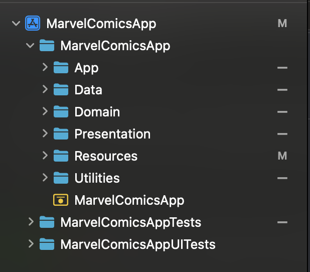
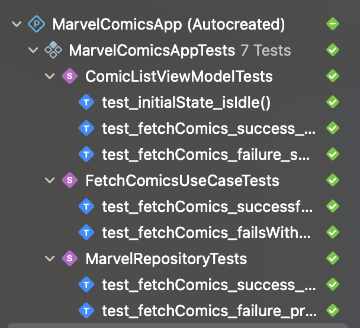
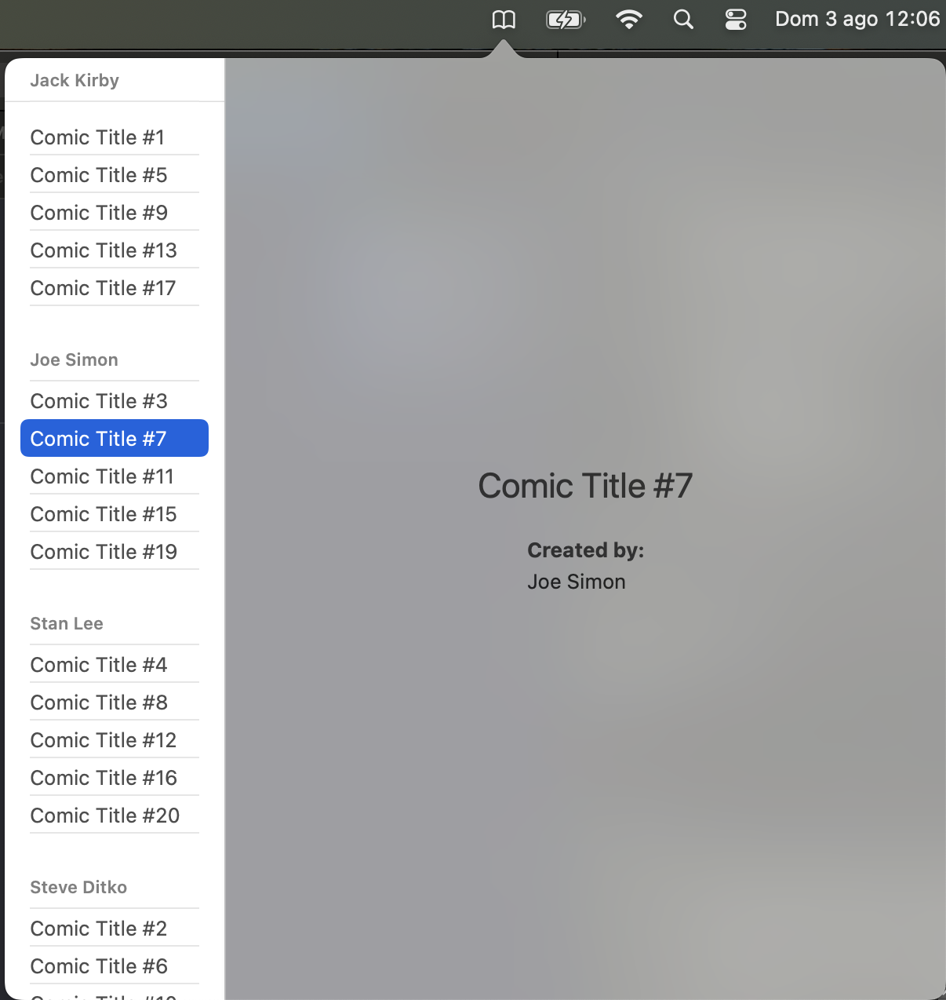

# MarvelComicsApp
technical challenge

# Documentation:
- SwiftUI (Clean Arquitecture)
- Calling to the API has been made without any third library
- Unit tests added

Screenshots





  
# MarvelComicsApp Installer

Este repositorio contiene la app **MarvelComicsApp** para macOS, empaquetada en un instalador `.pkg` que:

- Instala la app en `/Applications`
- Copia el `.plist` de `LaunchAgent` en `/Library/LaunchAgents`
- Activa la app para que se inicie automáticamente al arrancar el Mac

---

## 🔧 Requisitos

- macOS 12 o superior
- Xcode (para compilar la app)
- La app exportada en formato `.app` (ver más abajo)

---

## 🛠 Pasos para crear el instalador

### 1. Compilar y exportar la app

1. Abre el proyecto en Xcode
2. Selecciona esquema `Release`
3. Ve a `Product > Archive`
4. Al finalizar, elige:
   - `Distribute App > Custom > Copy App`
5. Guarda la app exportada en tu escritorio como:

```bash
~/Desktop/MarvelComicsApp.app
```

### 2. Ejecutar el script de instalación

Desde la raíz del repositorio, ejecuta:

```bash
chmod +x build_installer.sh
./build_installer.sh
```

Esto hará lo siguiente:

- Copia la app
- Crea el `LaunchAgent`
- Crea dos `.pkg`
- Los combina en `dist/MarvelComicsApp-Full.pkg`
- Activa el LaunchAgent con `launchctl`

---

## 📦 Instalación final

Instala el archivo generado:

```bash
open dist/MarvelComicsApp-Full.pkg
```

La app se instalará y se configurará para abrirse automáticamente al iniciar sesión.

---

## 🔁 Para desinstalar

```bash
sudo launchctl unload /Library/LaunchAgents/com.oscarga.marvelcomicsapp.plist
sudo rm /Library/LaunchAgents/com.oscarga.marvelcomicsapp.plist
sudo rm -rf /Applications/MarvelComicsApp.app
```

---

## 📁 Estructura del proyecto

```
Build/
├── Payload/Applications/MarvelComicsApp.app
├── LaunchAgent/com.oscarga.marvelcomicsapp.plist
├── MarvelComicsApp.pkg
├── LaunchAgent.pkg

dist/
└── MarvelComicsApp-Full.pkg
```

---

## ❓ Preguntas frecuentes

**¿Qué hace el LaunchAgent?**  
Inicia automáticamente la app cada vez que el usuario inicia sesión, usando `launchctl`.

**¿Por qué usamos `/Library/LaunchAgents` y no `~/Library/LaunchAgents`?**  
Para asegurar que el `LaunchAgent` se aplique a todos los usuarios (requiere permisos de administrador).

---

## 🧪 Testeado en

- macOS 15.5

---

## 🧑‍💻 Autor

Óscar R. Garrucho
Senior iOS/macOS Developer

Visit my blog for more info: [www.oscargarrucho.com](http://www.oscargarrucho.com/)


MIT License

Copyright (c) 2018 Chester How

Permission is as a result of this granted, free of charge, to any person obtaining a copy of this software and associated documentation files (the "Software"), to deal in the Software without restriction, including without limitation the rights to use, copy, modify, merge, publish, distribute, sublicense, and/or sell copies of the Software, and to permit persons to whom the Software is furnished to do so, subject to the following conditions:

The above copyright and permission notice shall be included in all copies or substantial portions of the Software.

THE SOFTWARE IS PROVIDED "AS IS", WITHOUT WARRANTY OF ANY KIND, EXPRESS OR IMPLIED, INCLUDING BUT NOT LIMITED TO THE WARRANTIES OF MERCHANTABILITY, FITNESS FOR A PARTICULAR PURPOSE AND NONINFRINGEMENT. IN NO EVENT SHALL THE AUTHORS OR COPYRIGHT HOLDERS BE LIABLE FOR ANY CLAIM, DAMAGES OR OTHER LIABILITY, WHETHER IN AN ACTION OF CONTRACT, TORT OR OTHERWISE, ARISING FROM, OUT OF OR IN CONNECTION WITH THE SOFTWARE OR THE USE OR OTHER DEALINGS IN THE SOFTWARE.


